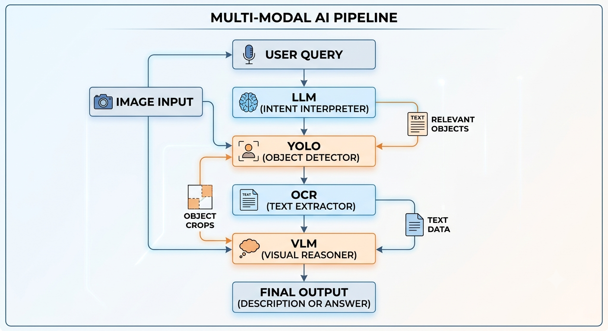

# Multi-Modal Book Search System

本專案是一套多模態書籍搜尋系統。使用者可以用自然語言描述想找的書，系統會從單張書架影像中找出最可能的目標書本，並輸出該書在影像中的位置。

系統整合了大型語言模型、YOLO 書本偵測、PP-OCRv6 文字辨識、sentence embedding 相似度比對，以及 VLM 視覺語言模型驗證。



## System Flow

整體流程如下：

```text
使用者輸入搜尋指令
  ↓
Gemma4 LLM 提取書名關鍵字
  ↓
YOLO 偵測並分割書本區域
  ↓
PP-OCRv6 辨識每一本書上的文字
  ↓
Sentence embedding 計算 OCR 文字與關鍵字相似度
  ↓
取 OCR 排名前 3 名候選書本
  ↓
VLM 依序檢查候選 crop
  ↓
若 VLM 相似度超過門檻，立即輸出結果
  ↓
若前 3 名皆未達門檻，輸出 VLM 分數最高者
```

## Modules

| File | Function |
|---|---|
| `answer_llm.py` | 使用 Gemma4 LLM 從使用者輸入中提取搜尋關鍵字 |
| `sg_text_v2.py` | 執行 YOLO 書本偵測與 PP-OCRv6 文字辨識 |
| `text_similarity.py` | 使用 sentence embedding 計算文字相似度 |
| `vision_qa_llm.py` | 使用 VLM 讀取候選書本 crop 中的書名 |
| `main.py` | 整合完整搜尋流程 |

## Keyword Extraction

使用者可以輸入自然語言，例如：

```text
我要寵物那本書
```

LLM 會將句子轉換成搜尋關鍵字：

```json
{
  "response": "好的，我可以幫您找到關於寵物的那本書。",
  "key": "寵物"
}
```

後續系統會使用 `key` 作為搜尋目標。

## YOLO and OCR

系統會先使用 YOLO segmentation model 偵測書本，取得每一本書的：

```text
bbox
mask
crop image
```

接著使用 PP-OCRv6 對每一本書的 crop 進行文字辨識，得到每本書的 OCR 結果。

OCR 輸出可能會包含錯字、漏字或多餘文字，因此後續不直接用字串完全匹配，而是透過相似度計算進行排序。

## Similarity Matching

相似度計算的核心函式是 `TextSimilarityMatcher` 類別中的：

```python
get_best_window_similarity(source_text, target_text)
```

它的主要功能是比較：

| Input | Meaning |
|---|---|
| `source_text` | OCR 或 VLM 辨識出的文字 |
| `target_text` | 使用者想尋找的目標關鍵字 |

為了提高比對準確率，系統採用 sliding window 方法，並結合語意相似度與字元重疊率計算最終分數。

### 1. Text Normalization

首先，系統會清除文字中的空白、換行與 tab，避免排版差異影響比對。

例如：

```text
我的 第一本
寵物 照護百科
```

會被整理成：

```text
我的第一本寵物照護百科
```

### 2. Sliding Window

OCR 文字通常比搜尋關鍵字長，因此系統會把 `source_text` 切成多個短片段。

視窗大小為：

```text
window_size = len(target_text) + padding
```

例如：

```text
target_text = 寵物
source_text = 我的第一本寵物照護百科
```

系統會產生多個重疊片段，例如：

```text
我的第一
的第一本
第一本寵
一本寵物
本寵物照
寵物照護
```

接著每個片段都會與 `target_text` 計算分數。

### 3. Semantic Score

系統使用 `SentenceTransformer` 將目標文字與每個片段轉成 embedding，並計算 cosine similarity。

公式如下：

```text
Semantic Score = (A · B) / (||A|| ||B||)
```

其中：

| Symbol | Meaning |
|---|---|
| `A` | 目標關鍵字的 embedding |
| `B` | OCR/VLM 片段的 embedding |

這個分數可以衡量兩段文字在語意上的接近程度。

### 4. Character Overlap Bonus

只看語意相似度有時不夠穩，尤其書名常常包含專有名詞、短詞或 OCR 錯字。因此系統額外加入字元重疊獎勵。

計算方式如下：

```text
Overlap Ratio = 命中的目標字元數量 / 目標字串的不重複字元總數
```

接著轉成 bonus：

```text
Bonus = Overlap Ratio × Bonus Weight
```

例如目標是：

```text
寵物
```

如果某個片段包含 `寵` 和 `物`，字元重疊比例就會很高。

在主流程中，OCR 階段與 VLM 階段會使用不同權重：

| Stage | Bonus Weight |
|---|---|
| OCR similarity | `1.00` |
| VLM similarity | `3.0` |

VLM 階段給較高權重，是因為 VLM 已經只看單本書 crop，若輸出的書名與關鍵字有字面命中，通常更值得信任。

### 5. Final Score

每個片段的最終分數為：

```text
Final Score = Semantic Score + (Overlap Ratio × Bonus Weight)
```

系統會比較所有片段的分數，回傳：

```text
最高分數
最佳匹配片段
```

例如：

```json
{
  "score": 3.52,
  "best_segment": "寵物照護"
}
```

這個分數會用於 OCR 排序、VLM 門檻判斷與最後候選書本選擇。

## VLM Verification

OCR 排名前 3 名會再交給 VLM 進行視覺確認。

VLM 不會直接看整張書架圖，而是只看單一本書的 crop，避免受到旁邊書本干擾。

檢查邏輯如下：

```text
1. 從 OCR 第一名開始交給 VLM 辨識
2. 將 VLM 輸出的書名與搜尋關鍵字計算相似度
3. 如果分數高於固定門檻，立即停止並輸出該書
4. 如果沒有通過門檻，繼續檢查下一名
5. 若前三名都未通過門檻，輸出 VLM 分數最高的候選
```

這樣可以減少不必要的 VLM 推理時間，同時保留二次確認能力。

## Output

系統最後會輸出：

```json
{
  "user_query": "我要寵物那本書",
  "key": "寵物",
  "found": true,
  "bbox": [x1, y1, x2, y2],
  "ocr_text": "...",
  "ocr_score": 0.0,
  "ocr_match": "...",
  "vlm_text": "...",
  "vlm_score": 0.0,
  "vlm_match": "...",
  "selection_mode": "vlm_threshold_accept",
  "result_image": "out_single_image_result/best_image.png"
}
```

其中 `result_image` 會在原圖上標示出最終選到的書本位置。

## Configuration

主要設定集中在 `main.py` 上方：

```python
USER_QUERY = "我要寵物那本書"
IMAGE_PATH = "book.png"
YOLO_MODEL_PATH = "book_seg.pt"
TOP_K_FOR_VLM = 3
VLM_ACCEPT_THRESHOLD = 2.5
OUT_DIR = "out_single_image_result"
```

若要更換圖片、搜尋文字或 VLM 門檻，只需要修改這些設定。

## Run

執行完整流程：

```bash
python main.py
```

執行後會產生：

```text
out_single_image_result/best_image.png
out_single_image_result/final_result.json
```

## Summary

本系統並不完全依賴單一模型，而是採用多階段驗證流程：

```text
LLM 理解使用者需求
YOLO 找出候選書本
OCR 讀取書名文字
Embedding 進行文字相似度排序
VLM 對高分候選進行視覺確認
```

透過這種方式，系統可以降低單純 OCR 錯字造成的誤判，也避免直接使用 VLM 處理整張圖片時產生不穩定或幻覺問題。
